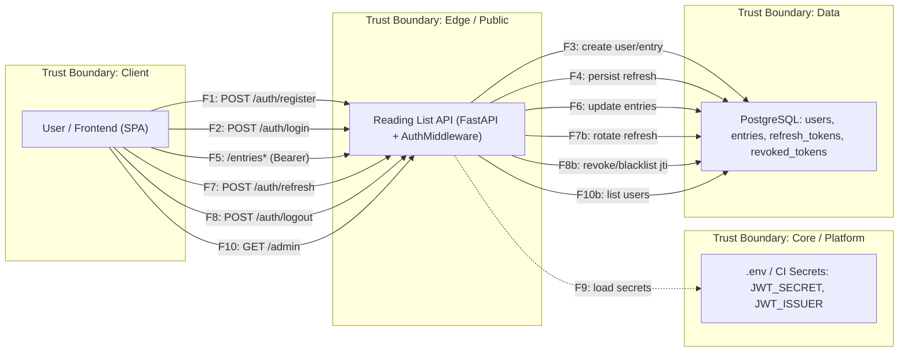

# DFD — Data Flow Diagram

## Диаграмма (Mermaid)

## Таблица потоков

| ID   | Откуда → Куда       | Канал / Протокол     | Данные / PII                    | Комментарий                                          |
|------|----------------------|----------------------|----------------------------------|------------------------------------------------------|
| F1   | Client → API         | HTTPS, JSON          | email, password                  | Регистрация пользователя                             |
| F2   | Client → API         | HTTPS, form-urlencoded | email, password               | Аутентификация по паролю                             |
| F3   | API → DB             | SQL                  | email, hashed_password, device_id | Создание записи пользователя в базе                 |
| F4   | API → DB             | SQL                  | refresh_token, jti, device_id   | Сохранение refresh-токена и его метаданных          |
| F5   | Client → API         | HTTPS, Bearer token  | JWT (access)                    | Работа с записями: создание, получение, изменение    |
| F6   | API → DB             | SQL                  | title, kind, link, status       | CRUD-операции с записями чтения                     |
| F7   | Client → API         | HTTPS, JSON          | refresh_token, device_id        | Запрос обновления access-токена                      |
| F7b  | API → DB             | SQL                  | old_refresh, new_refresh, jti   | Ротация refresh-токена: вставка нового, revoke старого |
| F8   | Client → API         | HTTPS, JSON + Bearer | refresh_token, jti, device_id   | Logout: отзыв refresh-токена                        |
| F8b  | API → DB             | SQL                  | jti, device_id                  | Занесение в blacklist и удаление refresh по устройству |
| F9   | API → SECRETS        | dotenv / env / CI    | JWT_SECRET, JWT_ISSUER          | Загрузка секретов при старте приложения             |
| F10  | Client → API         | HTTPS, Bearer token  | JWT (access)                    | Доступ к административному API                      |
| F10b | API → DB             | SQL                  | user_id, email (all users)      | Получение списка всех пользователей (админка)       |нет
